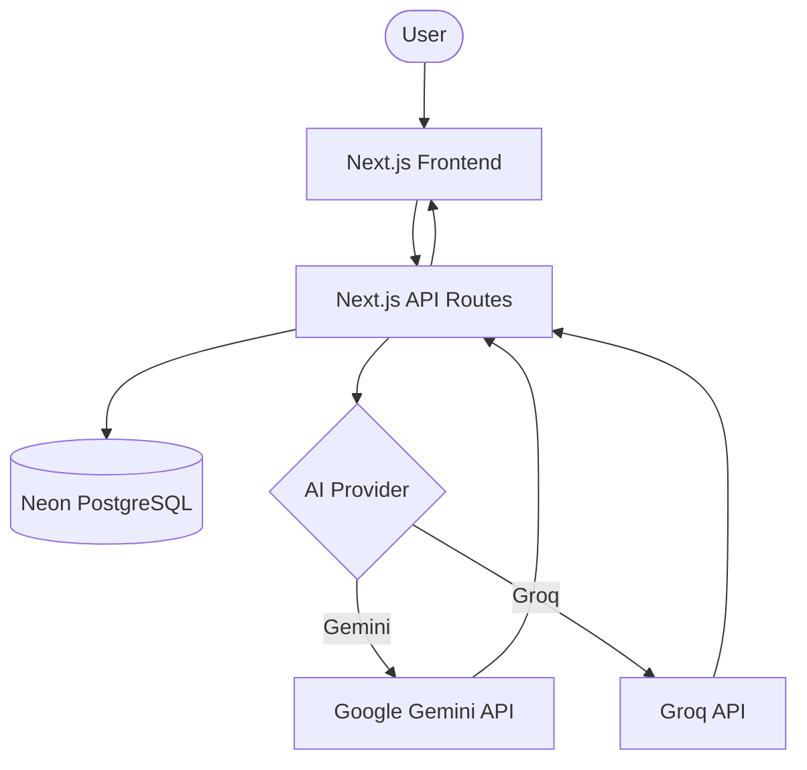

# 🚀 AI Startup Idea Validator

**Validate your next big idea in seconds with AI-driven market analysis.**

[](https://vercel.com/new/clone?repository-url=https%3A%2F%2Fgithub.com%2Fdeepaksai07%2FAI-Startup-Idea-Validator)

AI Startup Idea Validator is a high-performance web application that helps entrepreneurs refine and validate their startup concepts. By leveraging Google Gemini or Groq (Llama-3), it provides deep insights into problem-solution fit, target customers, market size, competitors, and technical feasibility.

---

## ✨ Features

- **Instant Analysis**: Get a comprehensive startup report in under 5 seconds.
- **Dual AI Support**: Choose between Google Gemini 1.5 Flash (default) or Groq Llama-3.
- **Deep Insights**: Analysis covers Problem, Customer, Market, Competitors, and Tech Stack.
- **Profitability Scoring**: Data-driven justification for market viability.
- **Persistent Storage**: All ideas and analyses are saved for future reference.

---

## 🛠️ Tech Stack

| Component | Technology |
| :--- | :--- |
| **Framework** | Next.js 15 (App Router) |
| **Styling** | Tailwind CSS 4.0 + Framer Motion |
| **Database** | Neon (PostgreSQL) |
| **ORM** | Prisma |
| **AI Providers** | Google Gemini / Groq (Llama-3) |
| **Deployment** | Vercel |

---

## 🏗️ Architecture



---

## 🚀 Getting Started

### 1. Prerequisites

- Node.js 18+
- A Neon Database (or any PostgreSQL instance)
- API Keys for Gemini or Groq

### 2. Environment Setup

Create a `.env` file in the root directory:

```env
DATABASE_URL="your_postgresql_url"
AI_PROVIDER="gemini" # or "groq"
GEMINI_API_KEY="your_key"
GROQ_API_KEY="your_key"
```

### 3. Installation

```bash
npm install
npx prisma generate
npx prisma db push
```

### 4. Running Locally

```bash
npm run dev
```

Visit `http://localhost:3000` to start validating.

---

## 📁 Project Structure

```text
├── prisma/               # Database schema
├── src/
│   ├── app/              # Next.js App Router (Pages & API)
│   ├── components/       # UI Components (Radix, Framer Motion)
│   ├── lib/              # AI integrations & Prisma client
│   └── types/            # TypeScript definitions
├── public/               # Static assets
└── .env                  # Environment variables (git-ignored)
```

---

## 📝 License

Distributed under the MIT License.

---

Built with ❤️ for entrepreneurs everywhere.
